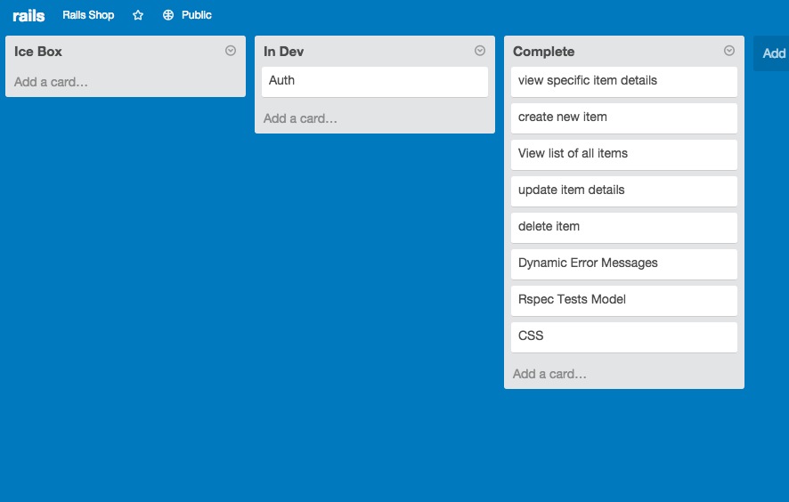

## README

* All the depenedencies are included in the gemfile and should be installed with bundle

* Database creation:
This app requires a postgres database.

* Database initialization:
For local dev use, create a database with be rake db:create, followed by be rake db:migrate

* How to run the test suite
This can be done by running
be rake rspec
* Deployment instructions
The master branch is setup for automatic deploys to heroku. [Rails Shop]("http://rails-shop-dbc.herokuapp.com")

